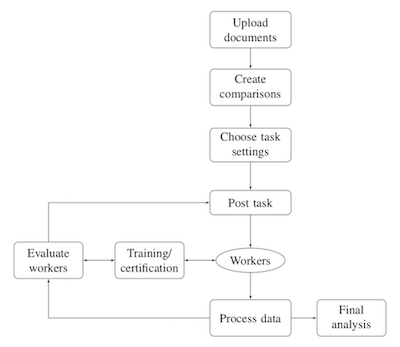

# Background

This is a tutorial on how to use the SentimentIt R package. SentimentIt provides a pairwise comparison framework for fast, flexible, and reliable human coding of political texts. The tutorial consists of three separate vignettes: one explaining how to send comparisons to Mechanical Turk and retrieve data, a second explaining how to perform analysis once data has been retreived, and a third explaining how to regulate who can work on your comparisons in Mechanical Turk. This is the third of the three tutorials.

The system we designed, which we label SentimentIt, is based on the following principles. First, it leverages human ability to understand language and socially constructed political concepts. Thus, our focus is measuring researcher-defined characteristics embedded within text (e.g., positivity). However, we exclude explicitly subjective characteristics (e.g., persuasiveness).

Second, we designed the task structure to be cognitively appropriate for non-experts. Specifically, we ask workers to conduct pairwise comparisons of texts, simply indicating which text is more extreme along a single dimension of interest (e.g., “Which text is more positive?”). A significant body of research indicates that pairwise comparisons can reduce the cognitive burden for respondents, improve the reliability of responses, and eliminate problems such as differential item functioning and reference group effects that plague alternative question formats such as Likert scales or sliders (e.g., King et al. 2004; Oishi et al. 2005).

When running an analysis, certifications can be used to control which workers are allowed to access your tasks. These certifications allow you to ensure that all workers have passed a training module, and no workers that you have determined delivery poor quality work are allowed to continue responding to your task (refer to the analyzing_data vignette for more information on how to use the `checkWorkers()` function to assess worker performance). Keep in mind that setting up a certification on SentimentIt is not sufficient, as the certification must also be set up in Mechanical Turk. Additional certification documentation can be found here: https://www.sentimentit.com/documentation/certifications.markdown.

A diagram of the SentimentIt workflow is shown below.



## checkCert

To check if a worker has a particular certification, use the `checkCert()` function. To use this function, you must know the name of the certification you would like to check for as well as the Mechanical Turk ID for the worker of interest.

### Syntax

```{r, eval = FALSE}

checkCert(email = "johndoe@school.edu", password = "12345",
          cert = "reviews", worker = "A115UFR6VA6OM1")

```

### Inputs

`checkCert()` accepts the following arguments:

-   `email`: Character vector, the email address for the registered SentimentIt account.

-   `password`: Character vector, the password associated with `email`.

-   `cert`: The name of the certification to be checked.

-   `worker`: The Mechanical Turk ID of the worker for whom the certification will be checked.

### Output

The `checkCert()` function outputs a logical vector, with `TRUE` indicating the specified worker does have the certification of interest, and `FALSE` indicating the worker does not have the certification.

## createCert

The `createCert()` function can be used to assign a certification to workers. If you attempt to assign a non-exist certification to a worker, this function will create the certification before assigning it. You can require workers to possess a particular certification to work on tasks you send to Mechanical Turk.

### Syntax

```{r, eval = FALSE}

createCert(email = "johndoe@school.edu", password = "12345",
          cert = "reviews", worker = "A115UFR6VA6OM1")

```

### Inputs

`createCert()` accepts the following arguments:

-   `email`: Character vector, the email address for the registered SentimentIt account.

-   `password`: Character vector, the password associated with `email`.

-   `cert`: The name of the certification to be assigned to the worker.

-   `worker`: The Mechanical Turk ID of the worker to whom the certification will be assigned.

### Output

The `createCert()` function outputs a character vector indicating how many workers were successfully certified and how many certifications were unsuccessful.

## revokeCert

The `revokeCert()` function can be used to revoke a certification from workers. By revoking the certification of workers, you can prevent these workers from completing your Mechanical Turk tasks that require these certifications.

### Syntax

```{r, eval = FALSE}

revokeCert(email = "johndoe@school.edu", password = "12345",
          cert = "reviews", worker = "A115UFR6VA6OM1")

```

### Inputs 

`revokeCert()` accepts the following arguments:

-   `email`: Character vector, the email address for the registered SentimentIt account.

-   `password`: Character vector, the password associated with `email`.

-   `cert`: The name of the certification to be revoked from the workers.

-   `worker`: The Mechanical Turk ID of the workers from whom the certification will be revoked.

### Output

The `revokeCert()` function outputs a character vector indicating how many certifications were successfully revoked from workers and how many revocations were unsuccessful.

Reference Paper
------

CARLSON, D., & MONTGOMERY, J. (2017). A Pairwise Comparison Framework for Fast, Flexible, and Reliable Human Coding of Political Texts. <i>American Political Science Review,</i> <i>111</i>(4), 835-843. doi:10.1017/S0003055417000302

